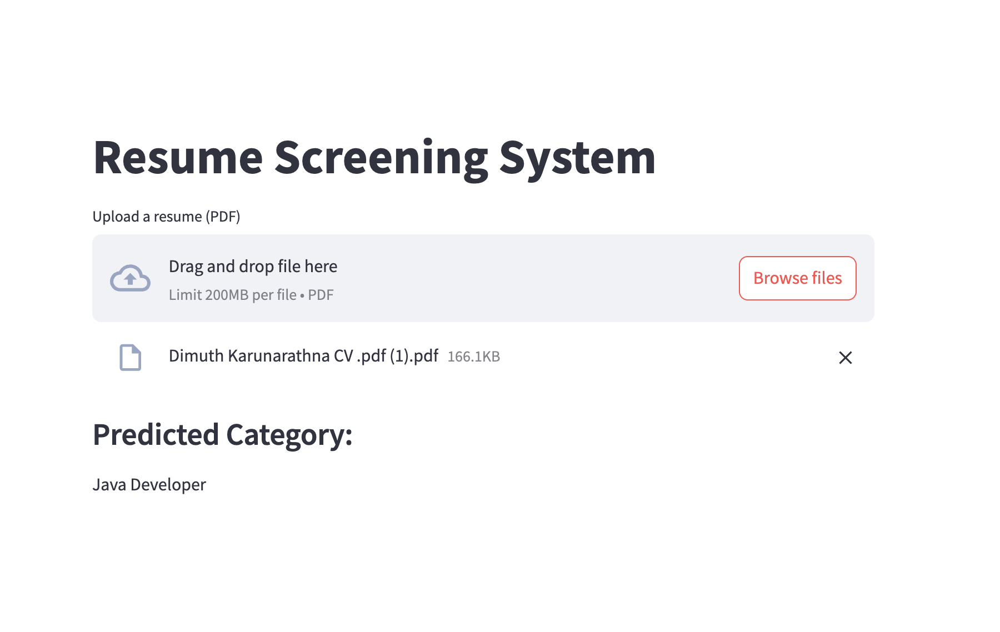

# 📄 Resume Screening System

A Machine Learning-based Resume Screening System that classifies resumes into different job categories using Natural Language Processing (NLP) and a Naive Bayes classifier. This project includes a

**Streamlit Web App** for easy resume upload and prediction.

## 🔍 Overview

This project automates the classification of resumes using text extracted from PDF files. It uses:

- Text preprocessing and cleaning
- TF-IDF feature extraction
- Multinomial Naive Bayes classifier
- Streamlit-based web interface for resume uploads
- Deployment-ready structure

---

## 🚀 Features

- Classifies resumes into predefined categories like **Data Science**, **HR**, **DevOps**, **Testing**, **Java Developer**, etc.
- PDF upload support with automatic text extraction
- Clean, preprocessed, and tokenized resume text
- TF-IDF vectorization
- Real-time predictions via a web interface

---

## 🧠 Tech Stack

| Component     | Technology                                      |
| ------------- | ----------------------------------------------- |
| Language      | Python 3.x                                      |
| Libraries     | NLTK, scikit-learn, pandas, seaborn, matplotlib |
| Web Framework | Streamlit                                       |
| ML Model      | Multinomial Naive Bayes                         |
| Vectorization | TF-IDF                                          |
| Model Saving  | joblib                                          |
| PDF Parsing   | PyPDF2                                          |

---

## 📁 Project Structure

Resume-Screening-System/
│
├── models/
│ ├── resume_classifier.pkl
│ ├── vectorizer.pkl
│ └── label_encoder.pkl
│
├── data/
│ └── UpdatedResumeDataSet.csv
│
├── app/
│ └── streamlit_app.py
│
├── Resume_Screening_System.ipynb # Colab Notebook
├── README.md
└── requirements.txt

streamlit run app/streamlit_app.py
